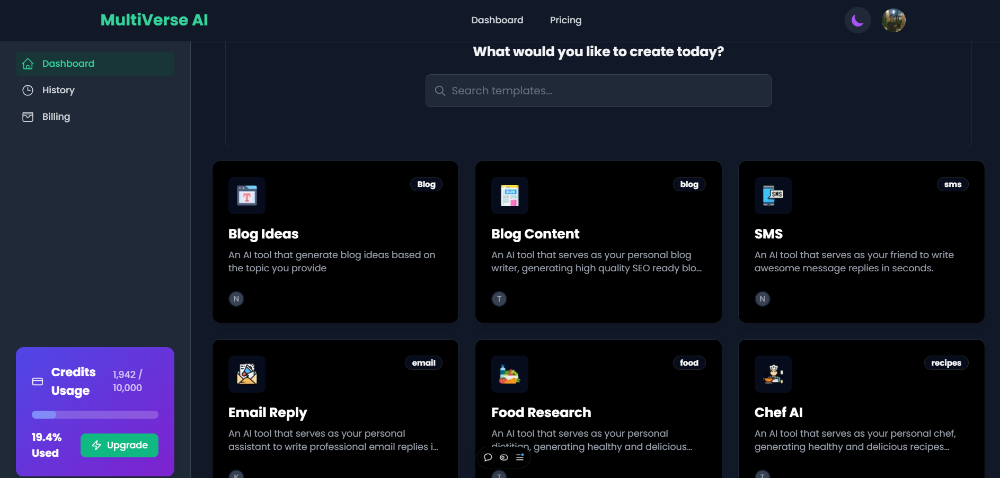

# 🚀 MultiVerse AI - AI-Powered Content Generation Platform



## 🌟 Overview

MultiVerse AI is a cutting-edge content generation platform that leverages artificial intelligence to revolutionize how we create content. From blog posts to code snippets, our platform empowers users to generate high-quality content with just a few clicks.

## ✨ Features

- 🤖 **AI-Powered Content Generation**
  - Blog post generation
  - Code snippet creation
  - Custom content templates
  - Real-time content editing

- 🔐 **Secure Authentication**
  - GitHub OAuth integration
  - Google Sign-in
  - Secure session management
  - Protected routes

- 🎨 **Modern UI/UX**
  - Responsive design
  - Dark/Light mode
  - Markdown editor
  - Real-time preview

## 🛠️ Tech Stack

- **Frontend:**
  - Next.js 15
  - React 18
  - Tailwind CSS
  - Framer Motion
  - Headless UI

- **Backend:**
  - Next.js API Routes
  - Prisma ORM
  - PostgreSQL Database
  - Auth.js (NextAuth)

- **Authentication:**
  - GitHub OAuth
  - Google OAuth
  - JWT Sessions

- **AI Integration:**
  - Google Generative AI
  - Custom AI Models

## 🚀 Getting Started

### Prerequisites

- Node.js 18+
- PostgreSQL Database
- GitHub OAuth App
- Google OAuth Credentials
- Stripe Account

### Installation

1. Clone the repository:
   ```bash
   git clone https://github.com/yourusername/multiverseai.git
   cd multiverseai
   ```

2. Install dependencies:
   ```bash
   npm install
   ```

3. Set up environment variables:
   ```env
   # Database
   DATABASE_URL="your_postgresql_url"

   # Authentication
   AUTH_GITHUB_ID="your_github_client_id"
   AUTH_GITHUB_SECRET="your_github_client_secret"
   AUTH_SECRET="your_auth_secret"

   # Stripe
   STRIPE_SECRET_KEY="your_stripe_secret"
   STRIPE_WEBHOOK_SECRET="your_webhook_secret"

   # AI
   GOOGLE_AI_API_KEY="your_google_ai_key"
   ```

4. Initialize the database:
   ```bash
   npx prisma generate
   npx prisma db push
   ```

5. Run the development server:
   ```bash
   npm run dev
   ```

## 🧪 Testing

Run the test suite:
```bash
npm test
```

For watch mode:
```bash
npm run test-watch
```

## 📦 Deployment

The application is configured for deployment on Vercel:

1. Push your code to GitHub
2. Connect your repository to Vercel
3. Configure environment variables
4. Deploy!

## 🔒 Security

- JWT-based authentication
- Secure session management
- Protected API routes
- Input sanitization

## 🤝 Contributing

1. Fork the repository
2. Create your feature branch (`git checkout -b feature/AmazingFeature`)
3. Commit your changes (`git commit -m 'Add some AmazingFeature'`)
4. Push to the branch (`git push origin feature/AmazingFeature`)
5. Open a Pull Request

## 🌐 Live Demo

Visit our live application at: [https://multiverseai.vercel.app](https://multiverseai.vercel.app)

---

Made with ❤️ 
